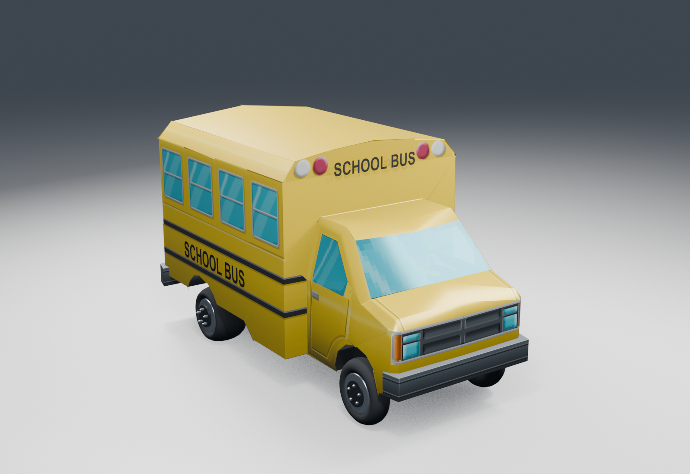

# Vehicle physics, walking and world objects

Cars now use four suspension contacts, wheel forces, angular velocity and chassis collision against the converted map. Traffic, police and mission vehicles feed steering and pedal inputs into the same solver. The earlier implementation moved vehicles along paths and treated the player's car mostly as a flat body.

Two reported failures shaped this pass. Cars could meet head-on because the road exporter treated directional road quads as two-way routes. A car landing against a wall could also remain on its side because collision response changed its position and linear velocity without applying the corresponding rotational impulse. Traffic now follows the source lane centres. The body solver integrates around the centre of mass and includes contact-point rotation, friction and recovery torque.

## What came from the executable

These addresses apply to the PAL `SLES_518.97` executable with SHA-256 `e936793df537c2764fae6908d52bbbcbc41606080855f1a26751ffb28bfbfa47`. Seven targeted Ghidra passes produced 459 successful exports covering 380 distinct physical-code addresses. There were zero export failures or unresolved requested functions. The selected functions do not constitute a recovered engine.

| Addresses | Recovered rule | Browser implementation |
| --- | --- | --- |
| `0x0027efe8`, `0x00280030`, `0x00280ca0` | Physics-locomotion construction and wheel-force dispatch. | A rigid body with four wheel contacts; a 60 Hz game update split into steps no larger than 1/120 second. |
| `0x0028f648`, `0x0027f978` | Spring stiffness scales with mass, gravity and suspension travel; damping uses `2 * sqrt(k * mass)`. Compression adds a quadratic spring term. | Per-car suspension tuning, with wheel positions and radii from each loaded model. |
| `0x00280ed8`, `0x002815b0`, `0x00281800` | Driven-wheel gas, brake and handbrake forces. | Rear-wheel drive, brake/reverse behavior, wheel spin and handbrake slip. |
| `0x00281958`, `0x00282010` | Normal/slipping steering forces and slip-state decisions. | Tyre forces use the original tuning and exported terrain material types. |
| `0x002801e8`, `0x00280388`, `0x0027fe48` | Upright torque, steering-assisted roll recovery and lowered centre of mass. | Contact-based recovery and steering assistance for a nearly stationary overturned car. The original activation flags are only partly understood. |
| `0x0012b8e8`, `0x0012e608`, `0x0012d9a0` | Speed-dependent lookahead, signed steering error divided by maximum wheel angle, and nearby-car avoidance. | Steering targets use at least five metres of lookahead and 0.8 seconds of travel. Ordinary traffic stays in lane and brakes; police and mission drivers may offset their target. |
| `0x0026e9f0`, `0x00121438`, `0x00267bc8` | Character defaults and walking acceleration. | Walk/run speeds of 4/8, acceleration 20 and deceleration 10 in world units per second. |
| `0x001248f0`, `0x00124cc0`, `0x00125b38` | Jump configuration, airborne update and second-jump conditions. | Gravity 25, first-jump height 1.9 and second-jump height 1. The second jump becomes available below upward speed 2 and before downward speed exceeds 12. |
| `0x0025b818`, `0x0025bca8` | Coin pickup bounds and attraction. | Original diamond-shaped horizontal reach, separate height limit, wider car reach and a 0.4-second attraction before wallet credit. |
| `0x0025aeb0`, `0x0025b2a0`, `0x0025be28`, `0x0025b098` | A 200-coin loose pool, launch/bounce update and full-pool credit. | Gravity 21, bounce factor 0.6, fading after 11 seconds and expiry after 16. Excess drops credit the wallet when the pool is full. |

The browser's vehicle gravity of 9.81, box inertia, contact restitution, drag calibration and collision solver are host implementation choices. Source force formulas and tuning constrain the behavior, but do not prove matching trajectories, braking distances or handling feel.

## World data and interactions

`tools/world_resources.py` exports source road ownership, directional lane quads, named junction links, lane counts, road limits and ground material types. The formats were checked against [LuaP3DLib's road chunk readers](https://github.com/Hampo/LuaP3DLib/tree/master/lib/P3DChunks).

| Level | Roads | Segments | Junctions | Prop placements |
| --- | ---: | ---: | ---: | ---: |
| 1 | 99 | 966 | 44 | 1,067 |
| 2 | 125 | 781 | 56 | 649 |
| 3 | 92 | 1,108 | 45 | 589 |
| 4 | 105 | 985 | 47 | 1,087 |
| 5 | 125 | 781 | 56 | 621 |
| 6 | 92 | 1,108 | 45 | 586 |
| 7 | 78 | 765 | 34 | 887 |

The 5,486 placements include static and interactive props. Animated dynamic wrappers contain the coin crates; those wrappers were absent from the earlier export. Another 61 scene exports supply previously missing instanced geometry. Repeated instance names are associated with their exact joint and instance transforms, and every interactive ID is checked against its render document. Existing ground buffers remain unchanged.

Kicking a crate releases ten coins. Other supported props award one coin and can raise Hit & Run heat. Destroyed props stay destroyed in the saved game. Some movable-object classes remain fixed physical obstacles after paying their reward; free prop rigid-body motion and the original debris system are unfinished. Mission power couplings retain their existing mission-specific behavior.

Walking uses finite solid shapes, so low barriers can be jumped. Vehicle roof collision updates each physics step and carries a standing player with the vehicle. Capsule dimensions and roof boxes are browser approximations. Double-jump and jump-kick clips were added for all five player characters and their converted outfits. Landing animation transitions and the original stomp-area attack still need work.

Coins use the original level drawable, locator positions and three collection sounds. Loose coins must bounce before normal pickup; car-generated drops attract after that bounce. Uncollected loose coins are temporary and are not restored after a reload.

## Bus and vehicle textures

All 71 Blender vehicle exports had their texture V coordinates inverted. The PS2 conversion uses a top-origin convention, while Blender's glTF exporter performs its own V conversion. Applying the correction once restores the original atlas placement; on the bus, windows and tyres are now on the right parts of the body.

The bus also has four geometry-based `SCHOOL BUS` labels in its original label positions. The underlying 128-pixel body artwork retains its source resolution. The editable scene is `blender/vehicle-texture-repair.blend`, generated locally and excluded from git.

## Rebuild and inspect

Run `npm run movement:convert` after the campaign and scenery conversions. It rebuilds world metadata, missing instances, player jump clips and coin audio. Run `npm run vehicles:repair-uv` for existing vehicle exports; corrected files are marked so the repair does not run twice. New Blender exports perform the correction during conversion. `npm run bus:remaster` rebuilds the bus lettering.

The seven native target lists are `movement-discovery.txt`, `player-coin-rules.txt`, `vehicle-physics-rules.txt`, `vehicle-force-rules.txt`, `vehicle-tuning-rules.txt`, `steering-rules.txt` and `steering-control-rules.txt` under `tools/native/`. Run each with `InspectNative.java` using the command in [Native executable findings](NATIVE_ANALYSIS.md). Generated assembly, pseudocode and reports remain under `artifacts/native/`.

The [validation log](../VALIDATION.md) records tests and assisted browser checks. Traffic's junction priority and recovery remain reconstructed behavior. Traffic lights, parked traffic, boarding ordinary traffic, gags and collectible cards are still unfinished, as are full campaign driving and original-game comparison runs.
