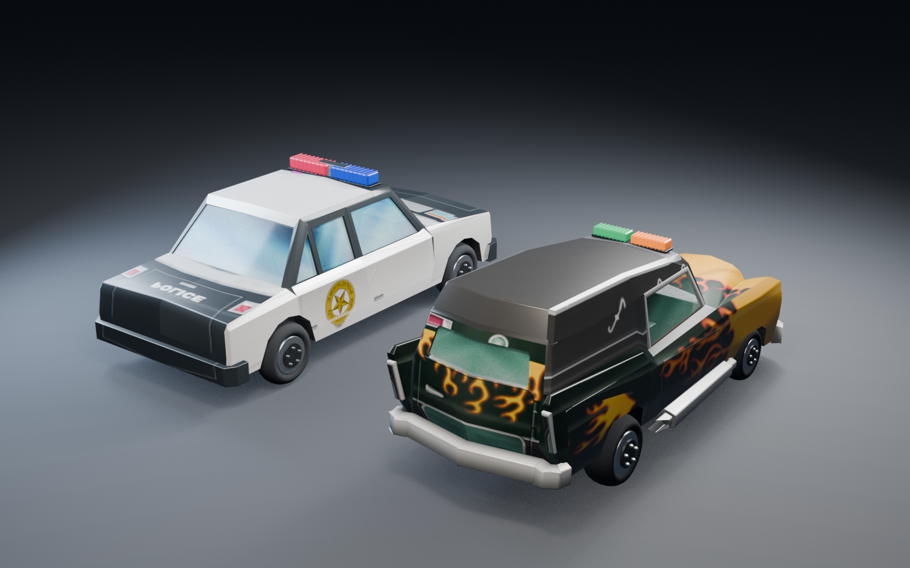

# Hit & Run encounters and traffic

Police encounters now use the original meter thresholds, decay rates, catch conditions and coin penalty. The browser runs a new implementation of these rules, informed by the PAL executable and the original level scripts.

Eleven completed analysis passes produced 485 function exports covering 380 distinct physical-code addresses. Ghidra exported every selected function; two requested addresses did not have recognized function bodies. One is a vehicle-collision event emitter. The other, the short `CloseTrafficGroup` callback, was inspected as four instructions that clear the script loader's group pointer. Generated assembly, pseudocode and per-pass reports remain under the local `artifacts/native/` directory.

These addresses apply to `SLES_518.97` with the hash recorded in [the executable findings](NATIVE_ANALYSIS.md). Function roles below are interpretations checked against their callers, instructions and data references.

## Rules recovered from the executable

| Behavior | Native evidence | Browser behavior |
| --- | --- | --- |
| Meter and pursuit | Constructor `0x00250d68`, update `0x00251c78` | Heat is capped at 100. Pursuit starts at 100 and its latch clears below 5. |
| Warning | Update `0x00251c78` | Warn at the stored 0.78 ratio; rearm below 60. The single-precision constant matters at exactly 78 heat. |
| Decay | Constructor and update above | Normal decay is 1 point/second by default, pursuit decay is 6, interior decay is 10. Normal offenses delay decay for 3 seconds. |
| Level override | Command callback `0x0017fba8` writes the normal-decay field | Level one uses 3 points/second, level two 1.5, later levels 1. Pursuit decay remains 6. |
| Offenses | Event handler `0x00251328` | Vehicle impact adds 5, vehicle destruction 25, prop destruction 7.5, hitting a pedestrian 10, kicking one 13. Vehicle impacts share the native 1.5-second quiet-period check. |
| Capture | Update `0x00251c78` | A chaser must remain within 10 metres for 0.75 seconds while the player's car is below 30 km/h. On foot, the continuous timer is 1.5 seconds. Leaving range resets it. |
| Speed units | Vehicle update `0x00287e10` | The field used for capture is explicitly converted from metres/second to km/h. |
| Fine | Event handler and `0x0025b950` | Losing 50 coins is capped by the available balance. Capture clears pursuit and briefly freezes play without restarting the mission. |
| Vehicle change | Entry emitter `0x00100868`, meter event handler | Entering a different vehicle clears heat. Re-entering the same managed vehicle does not repeatedly clear it. |
| Chase population | `0x0029a178`, `0x0029ad20`, level `CreateChaseManager` and `SetNumChaseCars` commands | One cruiser in levels 1–3, two in 4–6, two pursuit hearses in level 7. Spawn candidates come from roads intersecting the native 100-metre sphere. |

Mission commands can disable, enable or reset Hit & Run, set its meter, change normal decay and limit chasers. Mission retries clear active pursuit. Interiors block offenses and capture while heat decays. The original siren, busted sound, meter artwork and ticket image are connected to these events.

The unused PAL `SetHitAndRunDecayInterior` registration points at the same callback as `KillAllChaseAI`. This pass keeps the constructor's interior decay value; it does not invent a working version of that unused command.

## Traffic and character fixes

The old traffic simulation placed 22 cars around the whole map. Native `TrafficManager` construction at `0x00295128` allocates five slots. Its update at `0x00293dd8` searches every 200 ms, normally around a point 40 metres ahead of the camera heading. It uses 65 metres for spawning and 75 for removal, with a three-second initial period using a 100-metre spawn radius. Spawn checks include a 1.5-second prediction of the lane and player positions. `0x00295a68` returns the 60 km/h traffic speed for all seven levels.

The browser now uses that pool and the original model counts. `AddTrafficModel`'s third argument excludes a model from parked spawning; it is retained as metadata. Parked traffic spawning is still unfinished. [Command reference](https://docs.donutteam.com/docs/TheSimpsonsHitAndRun/Scripting/ConsoleCommands/AddTrafficModel).

Seven traffic models were missing from the converted assets: the armoured truck, fish truck, glass truck, Halloween car, second sports car, SUV and witch car. They are now included. Ordinary traffic also brakes for a stopped player, other vehicles and mission NPCs.

Routing now connects a vehicle to its position along a road segment. The previous endpoint-only search could send an approaching car backwards to the end of a long straight. The same correction applies to mission vehicles.

The tuning importer was applying commented-out experiments. Correcting it changed 15 mission/pursuit configurations, including police mass from the commented 750 kg value to the active 1,750 kg setting.

NPC impacts use the original flail and get-up clips, converted for all 67 characters and outfits. Kicking no longer counts as pressing the interaction button. A Halloween browser check also found unresolved swatch references in Ned, Fat Homer and Cool Lisa. Native character setup at `0x00270830` supplies the shared palettes separately; the converter now records explicit remaps for those missing references to the shared lit palette used by the browser's character material. All character textures are checked before release.

## Blender work

This is a Blender review render. Nine vehicles received a Blender pass: the two pursuit models and seven newly converted traffic vehicles. The cruiser and hearse have modeled, ribbed beacon lenses within their original light-bar bounds. Their red/blue and green/amber colors were sampled from the source UVs. Beacon tags let the game flash the exported materials during pursuit.

The pass adds a tyre normal map and adjusts paint, rubber and glass materials. Wheel hardware is batched per wheel to reduce separate meshes while retaining every original part identifier. The editable scene is saved locally as `blender/pursuit-modernisation.blend`; exported models and the manifest are included in the repository. Source body shapes, UVs and painted markings are preserved. Small source textures still limit the detail in those markings.

Regenerate the resources with `npm run pursuit:convert`, then the Blender exports with `npm run pursuit:remaster`. Native target lists in `tools/native/` can be used with `InspectNative.java` and the existing Ghidra project.

## Remaining differences

Steering, vehicle impact response and pedestrian knockback still use host simulation. The complete native vehicle physics and TrafficAI have not been ported. Traffic lights, parked traffic, boarding ordinary traffic vehicles and exact chaser retirement behavior still need work. The broader reconstruction also lacks complete gags, collectible-card gameplay and a full original-game playthrough comparison.
